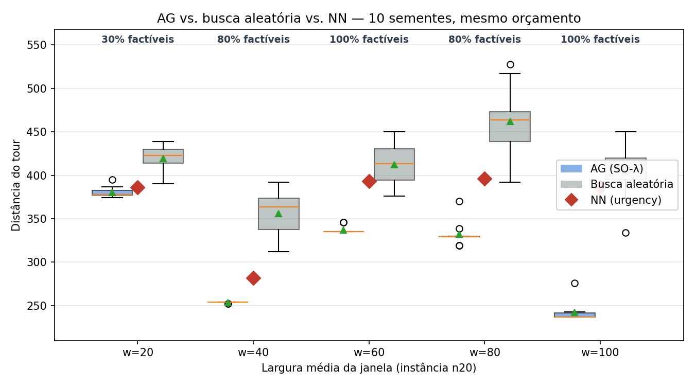
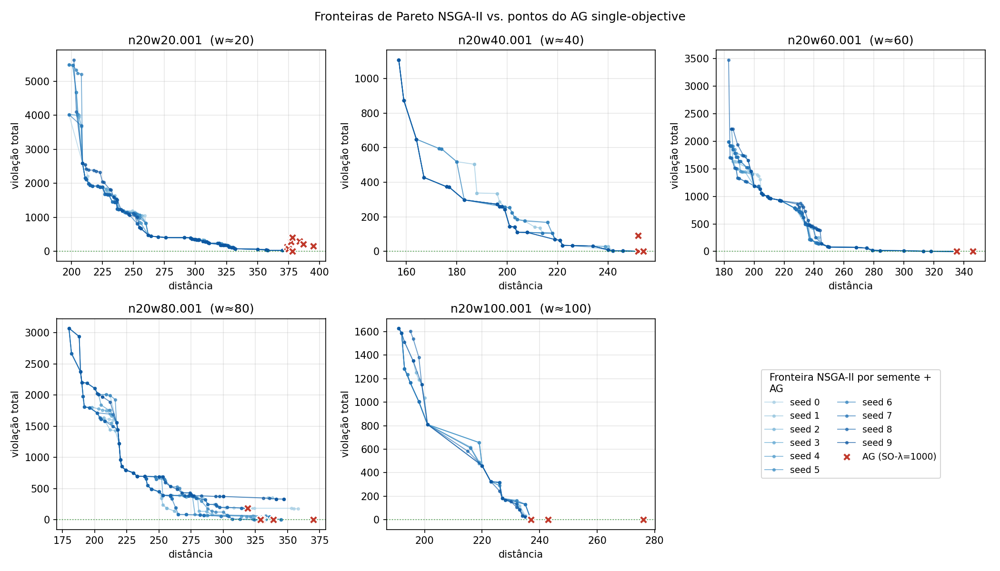
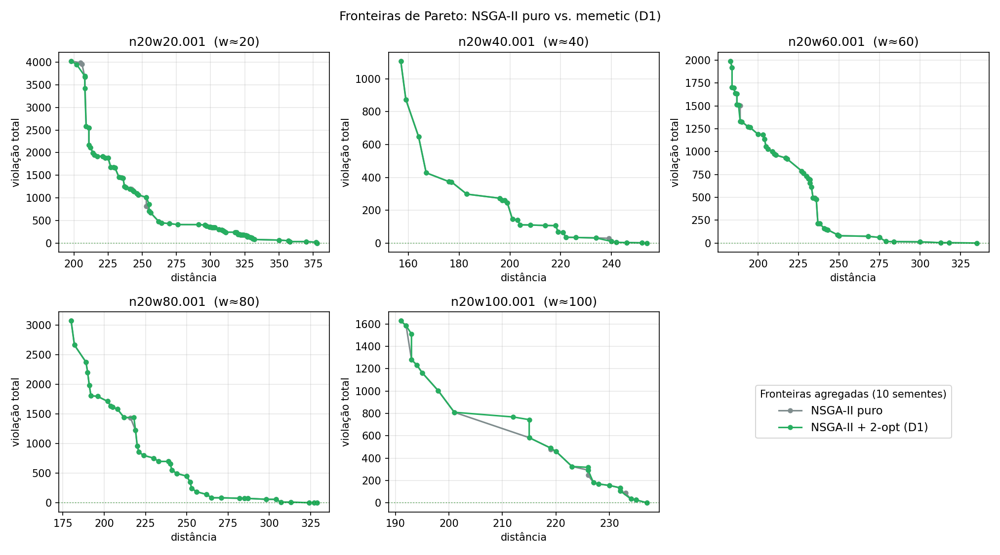

## Roteiro

1. Problema e motivação
2. Formulação
3. Métodos
4. Plano experimental
5. Resultados — SO vs MO
6. Diferencial D1 — Memetic
7. Discussão crítica
8. Conclusões

---

## 1. Problema e motivação

**TSP com Janelas de Tempo (TSPTW)** — extensão do TSP onde cada cidade $i$ tem janela $[e_i, l_i]$. O agente espera se chega antes, viola se chega depois.

- Adoção em logística real: entregas em horário comercial, agendamento médico, rotas escolares.
- A região factível é **uma fração minúscula** do espaço de permutações.
- Penalização escalar $f_1 + \lambda f_2$ requer ajuste de $\lambda$ — e pode fixar a busca em "atalhos infactíveis".

**Pergunta:** vale a pena trocar essa formulação por uma multiobjetivo?

---

## 2. Formulação

**Representação:** permutação $\pi = (\pi_1, \ldots, \pi_n)$.

**Cinética temporal:** $t_k = \max\{t_{k-1} + d_{\pi_{k-1}, \pi_k},\; e_{\pi_k}\}$

**Objetivos:**
- $f_1(\pi) = $ distância total
- $f_2(\pi) = \sum \max\{0, t_k - l_{\pi_k}\}$  (violação total)

**Três formulações comparadas:**
- **SO-$\lambda$:** $f = f_1 + 1000 f_2$ (Algoritmo Genético)
- **MO:** Pareto puro $(f_1, f_2)$ — NSGA-II
- **MO+LS:** NSGA-II + 2-opt Pareto (memetic, D1)

---

## 3. Métodos

### Componentes compartilhados

- Permutação `numpy.int64`, avaliação em $O(n)$.
- **OX** [Davis 1985] e mutação por **inversão** ($p=0,3$).
- Sementes fixadas (10 por instância).

### Diferenças

| | SO-$\lambda$ | MO | MO+LS |
|---|---|---|---|
| Algoritmo | AG | NSGA-II | NSGA-II + 2-opt |
| Pop | 200 | 100 | 100 |
| Gens | 1500 | 1500 | 1500 |
| Extra | $\lambda=1000$ | crowding distance | 2-opt $M=100, k=5$ |

---

## 4. Plano experimental

- **5 instâncias:** Dumas n=20, uma por largura de janela $w \in \{20,40,60,80,100\}$.
- **10 sementes** por método (R3 atendido plenamente).
- **3 métodos** + 2 baselines (NN-urgency, busca aleatória).
- **Métricas:**
  - SO: distância, violação, viabilidade, Wilcoxon, Cliff's $\delta$, Hedges' $g$.
  - MO: hypervolume (ref unificado), tamanho da fronteira, viabilidade.

**Reprodutível em 3 comandos** (`git checkout final && pip install && python …`).

---

## 5. Resultados — SO-$\lambda$ vs baselines

{width=80%}

- AG vence NN e Random em **todas** as 5 instâncias.
- Wilcoxon $p \leq 0{,}002$ após Bonferroni (10 sementes).
- Cliff's $\delta = -1{,}000$ (grande) em todos os pares.

**Mas:** AG é apenas 40–60% factível em janelas estreitas.

---

## 6. Resultados — MO vs SO

{width=78%}

**O NSGA-II é mais robusto onde a SO-$\lambda$ falha:**

| Instância | SO-$\lambda$ feas | MO feas |
|---|---:|---:|
| n20w20.001 | 40% → **(10 seeds)** | **(10 seeds)** |
| n20w40.001 | 60% → **(10 seeds)** | **(10 seeds)** |

A fronteira NSGA-II **contém** os pontos do AG-$\lambda$ — sem perda, com ganho de informação.

---

## 7. Diferencial D1 — Memetic com 2-opt Pareto

A cada $M=100$ gerações, aplica 2-opt sob dominância em $k=5$ indivíduos aleatórios da fronteira:

{width=80%}

- Ganho de HV concentrado em `n20w80.001`: **+3,7%** (10 sementes).
- Demais instâncias: $\pm 1\%$.
- Custo computacional: nulo (paradoxo da diversidade vs ordenação).

---

## 8. Discussão crítica — quando o D1 ajuda?

**Em `n20w80.001` (o caso patológico):**

| Métrica | Puro | Memetic |
|---|---:|---:|
| Viabilidade pontual | 40% | 40% |
| viol_min seeds infactíveis | 333–350 | **101–188** |

O 2-opt **empurra a fronteira em direção à viabilidade** mesmo quando não a cruza.

**Limitação reconhecida:** seleção *aleatória* dos pontos para busca local é ineficiente. Versão futura: focar em pontos com $f_2$ pequena mas positiva.

---

## 9. Ameaças à validade

- **Tamanho de instância:** apenas $n=20$. Para $n=40+$, espera-se ganho maior do memetic.
- **Random seeds:** 10 sementes; menor $p$-valor possível com Wilcoxon = 0,002.
- **Hiperparâmetros:** escolhidos por *sweep* informal — D3 (Optuna) seria a evolução natural.
- **Métrica única:** HV depende do ponto-ref; usamos referencial **unificado** para comparação justa entre métodos.

---

## 10. Conclusões

1. **MO supera SO quando a região factível é estreita.** Em `n20w20.001`, NSGA-II é robusto onde o AG-$\lambda$ vacila.
2. **MO+LS produz ganhos modestos mas direcionados.** Maior em `n20w80.001` — exatamente onde a hipótese previa.
3. **A fronteira de Pareto é mais informativa que um ponto único** — transfere a escolha do $\lambda$ para o decisor.
4. **Limites reconhecidos:** seleção aleatória no D1, escala $n=20$.

---

## 11. Trabalhos futuros

- **D1 v2:** 2-opt focado em pontos com $f_2$ pequena mas positiva.
- **HPO via Optuna (D3):** afinar `pop_size`, `n_generations`, parâmetros memetic.
- **Escala:** repetir o protocolo para $n=40$ e $n=60$.
- **Conexão real (D7):** aplicar a um dataset de rotas de saúde pública em Goiás.

---

## 12. Obrigado!

**Repositório:** github.com/DavideSouzaAndrade/heuristica_proj
**Tag da entrega:** `final`
**Reprodutível em 3 comandos.**

Perguntas?

::: notes
- Tempo total ~14 minutos, deixar 1 min de margem.
- Antecipar 2-3 perguntas:
  1. "Por que pop_size diferente entre AG e NSGA-II?" → custo O(N²) sorting.
  2. "Por que não usaram HPO?" → escolha por escopo; está nas direções futuras (D3).
  3. "O memetic ajuda em quais casos?" → quando a fronteira tem muitos pontos quase-factíveis.
:::
